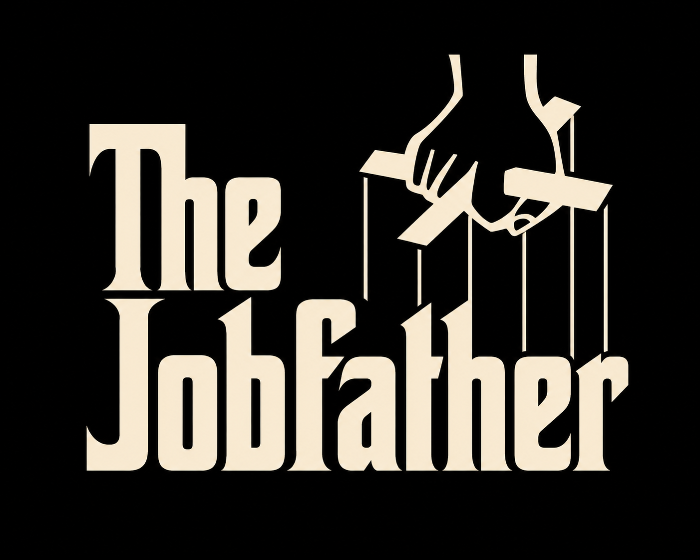

# The Jobfather

  

<h2 align="left">
  <em><b>“I'm gonna get them an offer they can't refuse.”</b></em>
</h2>

A Python-based human-in-the-loop agentic tool for job searching, tracking, and workflow automation.

Still a work in progress.

## Fit Assessment Pipeline

Assesses job fit via a 7-step LangGraph pipeline:

1. **Classify Role** — breaks the role into % categories (coding, stakeholder, data engineering, consulting, research)
2. **Translate Experience** — maps CV/profile elements to role-specific relevance
3. **Analyze Gaps** — identifies missing skills as hard/soft/negotiable gaps
4. **Assess Hiring Risk** — evaluates risk per area (technical interview, domain knowledge, seniority, etc.)
5. **Analyze Career Trajectory** — 2–3 year outlook and strategic fit
6. **Build Application Story** — crafts narrative, pitch, and interview risk prep
7. **Produce Assessment** — generates dimension scores, overall recommendation, and stitches all intermediate output into the final result

Each step has a dedicated LLM call with a focused prompt, feeding into the next. The enriched output (role breakdown, gaps, story, etc.) is persisted to SQLite alongside dimension scores.

## Google Docs Integration Setup

The project uses OAuth 2.0 (Desktop app flow) to read, create, and edit Google Docs — no API key needed.

### One-time setup

1. Go to [Google Cloud Console](https://console.cloud.google.com/)
2. Create a project (or use an existing one)
3. Enable the **Google Docs API** and **Google Drive API** under *APIs & Services > Library*
4. Go to *APIs & Services > Credentials*, click **Create Credentials > OAuth client ID**
5. Select **Desktop app**, give it a name, and click **Create**
6. Download the JSON file and save it as `credentials.json` in the project root
7. On first use, a browser window opens for Google account consent — after that, a `token.json` is auto-generated and reused

Both `credentials.json` and `token.json` are gitignored.